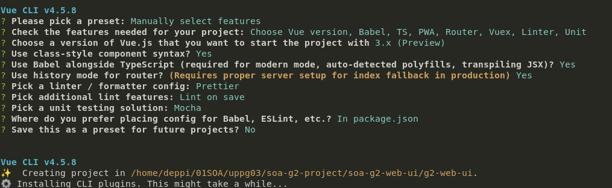

# SOA Grupp2 Services User Interface
A Vue.js frontend app to give GUI to the new SOA architecture for EA & SOA course at LTU four Group 2 HT2020.

If you need access to writing data to your Canvas user then set the env vars where the app is running. 
```cookie
export VUE_APP_CANVAS_TOKEN="Babadfdbadffvdsf234234acsfvsdf"
export VUE_APP_CANVAS_USER="651234"
```

# Typescript and ESLint
The webpack build process uses Babel among others. What is frequently an issue is that because we are working with Vue.js 3 and it's nor got full support in many dependencies (i.. we are using beta versions of a lot of stuff) we can frequently get ESLint errors. This is of course bad... but one solution is simply to edit `.tsconfig.json` and set strict-mode to `false`. This let's you compile and play around much more freely.
A better option would be to have per-file rules and the likes. The problem is that due to the build process going through Webpack a lot of these per-file rules are completely ignored, and support seems to be sometimes there, sometimes not. Anyhow... just bare that in mind. Also the paths and specified items in `.eslintignore` do not work as intended - possibly due to the folder structure changing as it goes through the WebPAck compile process. 

# To remember
This project attempts to use the most recent versions of the various technologies involved. This means Vue.js 3, and class-based component syntax, among others. For the screenshot of initial project choices we have:


# Time slots
Time slots:
    08.15 - 09.45: 1.5h
    10.15 - 11.45: 1.5h
    13.00 - 14.30: 1.5h
    14.45 - 16.15: 1.5h
    16.30 - 18.00: 1.5h


# Getting started
Make sure you have Node, Node Package Manager amd and Vue-cli installed on your system.


```bash
$ node --version
v14.4.0

$ npm --version
6.14.5

$ vue --version
@vue/cli 4.5.8
```

See [installing Node and NPM on Ubuntu 18LTS](https://www.digitalocean.com/community/tutorials/how-to-install-node-js-on-ubuntu-18-04), and for [Vue-cli install](https://cli.vuejs.org/guide/installation.html).

Now, it's time to install the actual project dependencies (as are found in `package.json`), the command for this is `npm install`.

Then, once all these requirements are satisifed we can do various things. For example on the command line in the project repository:

```bash
# Stats about dependencies in browser
vue ui

# Compiles and hot-reloads for development
npm run serve

# Compiles and minifies for production
npm run build

# Run your unit tests
npm run test:unit

# Run your end-to-end tests
npm run test:e2e
```

### Customize configuration
See [Configuration Reference](https://cli.vuejs.org/config/).


# Principal project dependencies
Axios - for requests to API's


